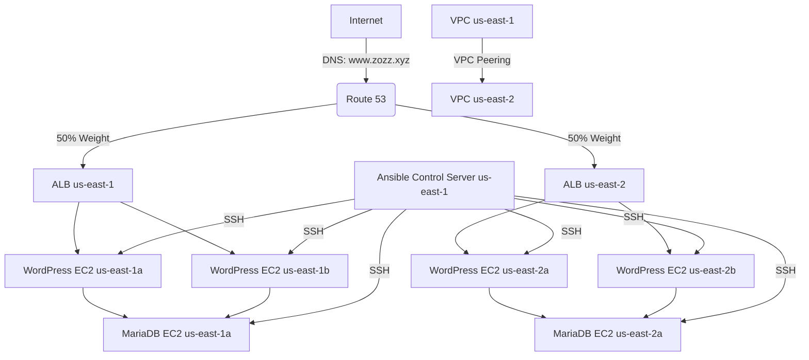

# 🌟 WordPress Multi-Region AWS Deployment with Terraform and Ansible

Welcome to the **WordPress Multi-Region AWS Deployment** project! This repository provides a robust infrastructure setup for deploying a highly available WordPress application across two AWS regions (**us-east-1** and **us-east-2**) using **Terraform** for infrastructure provisioning and **Ansible** for configuration management. The setup includes VPC peering, load balancers, Route 53 for DNS, and secure networking with MariaDB databases in private subnets.

---

## 🎯 Project Overview

This project automates the deployment of a WordPress application with the following key features:
- **Multi-Region Architecture**: Deploy WordPress instances in **us-east-1 (Virginia)** and **us-east-2 (Ohio)** for high availability.
- **VPC Peering**: Connects VPCs across regions for seamless communication.
- **Load Balancing**: Application Load Balancers (ALBs) distribute traffic across WordPress instances.
- **Route 53**: Weighted routing policy for traffic distribution to ALBs in both regions.
- **Secure Networking**: Public subnets for WordPress, private subnets for MariaDB, and security groups for controlled access.
- **Ansible Automation**: Configures Apache, PHP, WordPress, and MariaDB on EC2 instances.
- **Infrastructure as Code**: Terraform scripts define all AWS resources.

The project is organized into modular Terraform files, each responsible for a specific component of the infrastructure, and Ansible playbooks for server configuration.

---

## 🛠️ Architecture Diagram



---

## 📂 Repository Structure

The repository contains Terraform files, each with a specific purpose, and Ansible configuration files. Below is a breakdown of the key files and their roles:

### Terraform Files

- **`main.tf`**
  - Initializes Terraform and configures AWS providers for **us-east-1** (Virginia) and **us-east-2** (Ohio).
  - Retrieves AWS caller identity for account details.

- **`variables.tf`**
  - Defines sensitive variables like AMI IDs, instance types, and EC2 key pairs.

- **`vpc_and_subnets_east_1.tf`**
  - Sets up the VPC, public/private subnets, Internet Gateway, NAT Gateway, and route tables for **us-east-1**.
  - Configures load balancer target groups and listeners.

- **`vpc_and_subnets_east_2.tf`**
  - Similar to `vpc_and_subnets_east_1.tf` but for **us-east-2**.

- **`security_groups_east_1.tf`**
  - Defines security groups for WordPress, MariaDB, Ansible control server, and ALB in **us-east-1**.
  - Controls ingress/egress rules for HTTP, HTTPS, SSH, and MariaDB ports.

- **`security_groups_east_2.tf`**
  - Similar to `security_groups_east_1.tf` but for **us-east-2**.

- **`ec2_instances_us_east_1.tf`**
  - Provisions EC2 instances for WordPress, MariaDB, and Ansible control server in **us-east-1**.

- **`ec2_instances_us_east_2.tf`**
  - Provisions EC2 instances for WordPress and MariaDB in **us-east-2**.

- **`load_balancer_us_east_1.tf`**
  - Configures the Application Load Balancer for **us-east-1**.

- **`load_balancer_us_east_2.tf`**
  - Configures the Application Load Balancer for **us-east-2**.

- **`vpc_peering.tf`**
  - Establishes VPC peering between **us-east-1** and **us-east-2** with appropriate route table updates.

- **`route_53_LB.tf`**
  - Configures Route 53 with a hosted zone for `zozz.xyz` and weighted A records for load balancers.

- **`outputs.tf`**
  - Outputs critical information like public/private IPs and security group IDs.
  - Generates Ansible configuration files (`wp-config.php`, `hosts.ini`, playbooks).

- **`zip_ansible_conf.tf`**
  - Manages file transfers to the Ansible control server and executes playbooks for **us-east-1** and **us-east-2**.

### Ansible Configuration

- **`ansible-config/hosts.ini`**
  - Ansible inventory file listing WordPress and MariaDB servers in both regions.

- **`ansible-config/playbook_virginia.yaml`**
  - Ansible playbook for configuring servers in **us-east-1**.

- **`ansible-config/playbook_ohio.yaml`**
  - Ansible playbook for configuring servers in **us-east-2**.

- **`ansible-config/roles/`**
  - Contains roles for Apache, PHP/WordPress, and MariaDB setup (not shown in provided files but referenced in playbooks).

---

## 🚀 Getting Started

### Prerequisites

- **Terraform** (v1.0+)
- **AWS CLI** configured with appropriate credentials
- **Ansible** installed on your local machine or Ansible control server
- **SSH key pair** (`ec2-ansible.pem`) for EC2 access
- **Domain** registered for Route 53 (e.g., `zozz.xyz`)

### Setup Instructions

1. **Clone the Repository**
   ```bash
   git clone https://github.com/your-username/wordpress-multi-region-aws.git
   cd wordpress-multi-region-aws
   ```

2. **Configure Variables**
   - Create a `terraform.tfvars` file with the following:
     ```hcl
     ami_ubuntu_east_1 = "ami-xxxxxxxxxxxxxxxxx"
     ami_ubuntu_east_2 = "ami-xxxxxxxxxxxxxxxxx"
     instance_type     = "t2.micro"
     key-ec2           = "your-key-pair-name"
     ```
   - Replace placeholders with valid AMI IDs and your EC2 key pair name.

3. **Initialize Terraform**
   ```bash
   terraform init
   ```

4. **Plan and Apply**
   ```bash
   terraform plan
   terraform apply
   ```
   - Review the plan and confirm to deploy the infrastructure.

5. **Ansible Configuration**
   - The `zip_ansible_conf.tf` automatically transfers Ansible files to the control server and runs playbooks.
   - Ensure the `ec2-ansible.pem` file is in the project root with appropriate permissions (`chmod 400 ec2-ansible.pem`).

6. **Access the Application**
   - Visit `http://www.zozz.xyz` to access the WordPress site.
   - Traffic is distributed across regions via Route 53 weighted routing.

---

## 🔒 Security Considerations

- **Security Groups**:
  - WordPress instances allow HTTP (80), HTTPS (443), and SSH (22, restricted to Ansible control server).
  - MariaDB instances allow MySQL (3306) only from WordPress instances and SSH from the Ansible server.
  - ALBs allow HTTP (80) from anywhere.

- **Private Subnets**:
  - MariaDB instances are in private subnets, inaccessible from the public internet.

- **VPC Peering**:
  - Ensures secure communication between regions without public internet traversal.

- **Sensitive Data**:
  - AMI IDs and instance types are marked as sensitive in `variables.tf`.
  - Hardcoded credentials in `wp-config.php` should be replaced with AWS Secrets Manager in production.

---

## 🛠️ Troubleshooting

- **SSH Issues**:
  - Verify `ec2-ansible.pem` permissions and Ansible control server connectivity.
  - Check security group rules for port 22.

- **WordPress Not Loading**:
  - Ensure ALB listeners and target groups are correctly configured.
  - Verify Route 53 records point to the correct ALB DNS names.

- **MariaDB Connectivity**:
  - Confirm security group rules allow port 3306 from WordPress instances.
  - Check VPC peering routes for cross-region communication.

- **Ansible Failures**:
  - Inspect logs on the Ansible control server (`/home/ubuntu/ansible-config`).
  - Ensure the `script.sh` user data script installs Ansible correctly.

---

## 🌈 Future Improvements

- **Auto Scaling**: Add Auto Scaling Groups for WordPress instances to handle traffic spikes.
- **RDS for MariaDB**: Replace EC2-based MariaDB with AWS RDS for managed databases.
- **Secrets Management**: Use AWS Secrets Manager for database credentials.
- **HTTPS**: Configure SSL certificates with AWS Certificate Manager for secure connections.
- **CI/CD**: Integrate with GitHub Actions for automated deployments.

---

## 📜 License

This project is licensed under the MIT License. See the [LICENSE](LICENSE) file for details.

---

## 🙌 Contributing

Contributions are welcome! Please open an issue or submit a pull request with your improvements.

---

**Happy Deploying!** 🚀